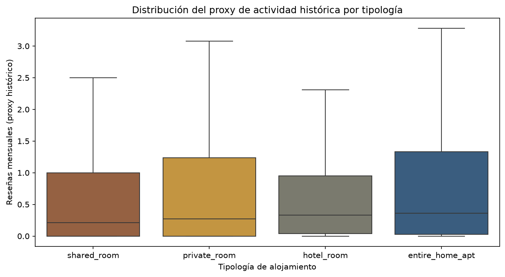
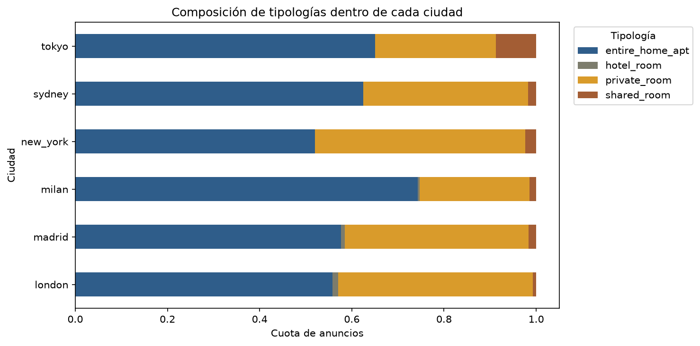
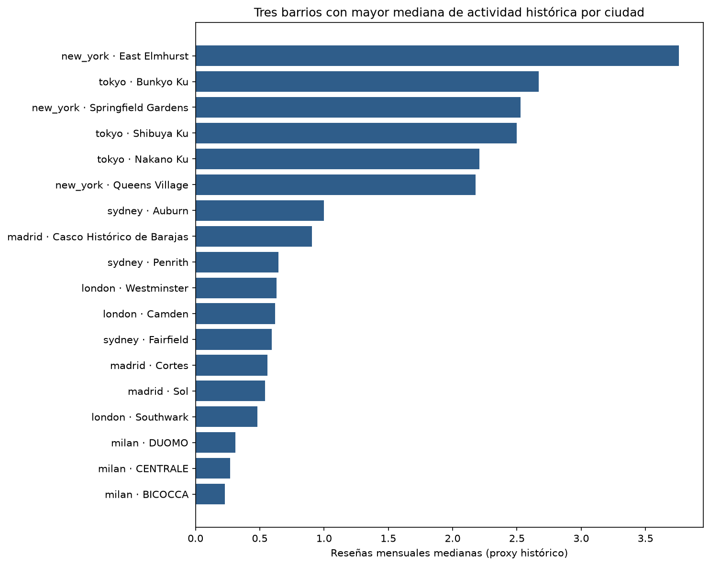
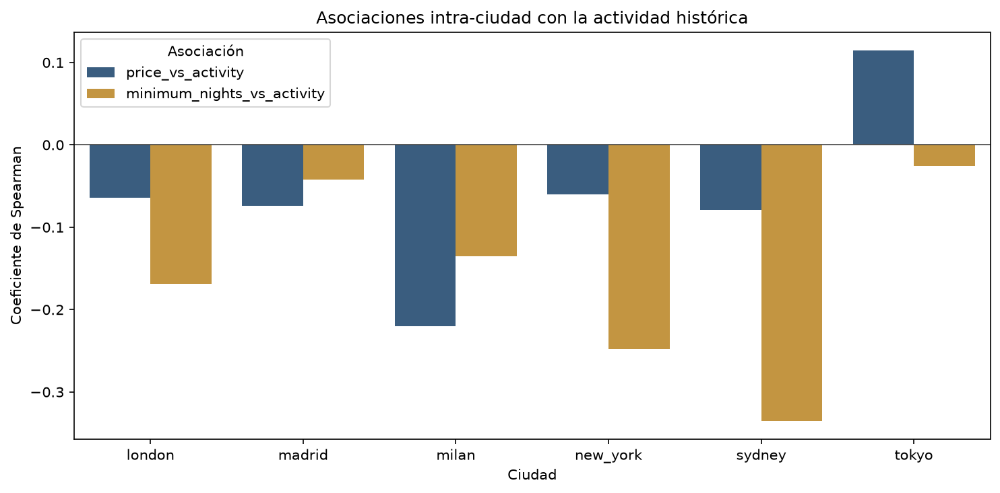
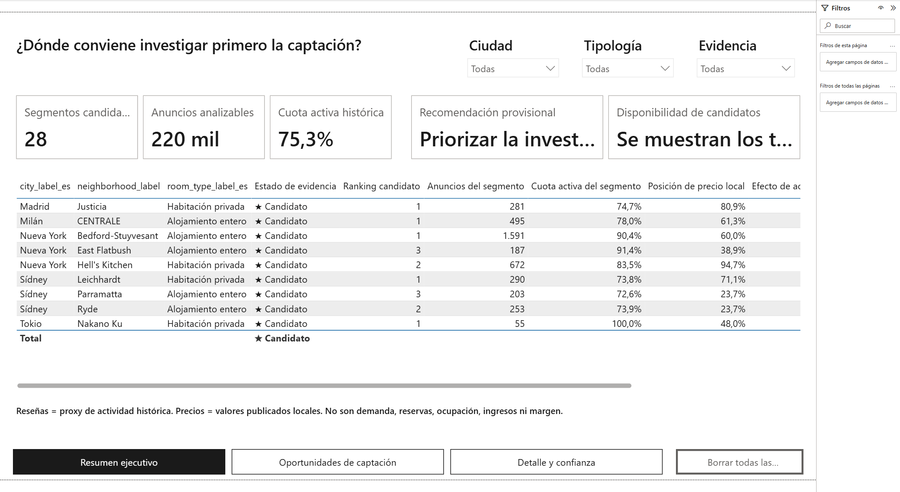
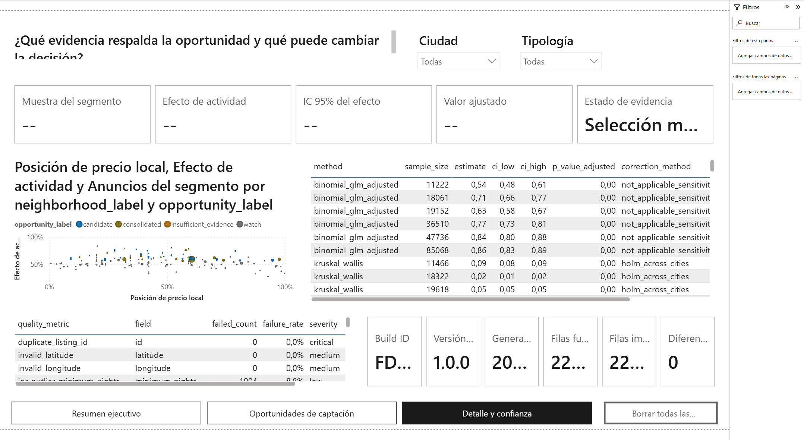

# Guía de estudio: análisis de oferta de Airbnb

## Resumen técnico

Este proyecto enseña a convertir seis CSV heterogéneos en una recomendación de negocio reproducible.
La secuencia completa es `fuentes -> auditoría -> ETL -> EDA -> inferencia -> segmentación -> Power BI`.
La decisión que se apoya es qué combinaciones de ciudad, barrio y tipología conviene investigar para
captar oferta. La métrica principal es un proxy de actividad histórica de reseñas y no un resultado
comercial.

El resultado más importante no es un ranking aislado. Es un método para distinguir una diferencia
estadísticamente detectable de una oportunidad suficientemente grande, estable y accionable. El
proyecto identifica 28 candidatos: 13 en Sídney, 12 en Nueva York y uno en Madrid, Milán y Tokio.
Londres queda en observación porque ninguna combinación supera todos los filtros.

## 1. Objetivos de aprendizaje

Al terminar esta guía deberías poder:

1. explicar qué es un EDA y por qué precede a cualquier contraste o modelo;
2. elegir visualizaciones según el tipo de variable y la pregunta;
3. detectar valores ausentes, inconsistencias y outliers sin ocultarlos;
4. escribir un notebook que otra persona pueda leer, ejecutar y auditar;
5. diferenciar significación estadística, tamaño del efecto e importancia de negocio;
6. describir cómo Python alimenta un modelo semántico de Power BI;
7. justificar la segmentación por ciudad, barrio y tipología;
8. presentar conclusiones con evidencia, implicación y limitación.

## 2. El mapa mental del proyecto

| Etapa | Pregunta | Evidencia producida |
|---|---|---|
| Inventario | ¿Son estas exactamente las seis fuentes esperadas? | tamaño, filas, cabecera y SHA-256 |
| Auditoría | ¿Qué problemas contiene cada fuente? | completitud, duplicados, rangos y outliers |
| ETL | ¿Cómo se crea un esquema comparable sin inventar datos? | dataset canónico y conciliación |
| EDA | ¿Qué forma, composición y patrones presentan los datos? | tablas y gráficos descriptivos |
| Inferencia | ¿Las diferencias son compatibles con algo más que azar muestral? | test, efecto, intervalo y ajuste |
| Segmentación | ¿Dónde coincide actividad, escala, evidencia y baja cuota? | matriz de oportunidades |
| Comunicación | ¿Cómo explora el resultado un perfil no técnico? | notebooks, Power BI y documentación |

Una buena defensa oral debe mantener este orden. Si se empieza directamente por el dashboard, se
ocultan las decisiones que determinan qué significa cada número.

## 3. Qué es un EDA completo

EDA significa *Exploratory Data Analysis* o análisis exploratorio de datos. Es el proceso de conocer
la estructura, calidad y comportamiento de un dataset antes de formular conclusiones definitivas. Un
EDA completo combina inspección tabular, estadística descriptiva, visualización y preguntas sobre el
proceso que generó los datos.

### 3.1 Comprender el grano y los tipos

El grano responde a la pregunta «¿qué representa una fila?». Aquí una fila representa un anuncio,
identificado de forma única por `city_key + listing_id`. Mezclar anuncios con agregados de barrio en
la misma tabla produciría conteos dobles y comparaciones incorrectas.

Después se clasifican las variables:

- **identificadores:** `listing_id`, `host_id`; sirven para unicidad o agrupación, no para promedios;
- **categóricas:** ciudad, barrio y `room_type`; se estudian con frecuencias y proporciones;
- **numéricas:** precio, noches mínimas, reseñas y actividad; se estudian con distribución y resumen;
- **temporales:** `last_review`; su ausencia no debe sustituirse por cero;
- **geográficas:** latitud y longitud; requieren validación de rango;
- **indicadores de calidad:** campos `*_is_valid`, `*_source_available` y
  `activity_proxy_derived_zero`.

### 3.2 Completitud, coherencia y duplicados

Un nulo no siempre significa lo mismo. Puede representar un dato desconocido, un atributo no
disponible en la fuente o una ausencia interpretable por una regla de negocio. El ETL conserva esa
diferencia:

- 54.248 tasas mensuales se convierten en cero únicamente porque el anuncio tiene cero reseñas;
- 123 tasas ausentes con reseñas positivas siguen siendo desconocidas;
- la cantidad de anuncios del anfitrión y la disponibilidad anual no existen en Tokio y se marcan
  como ausencia estructural;
- ninguna fila se elimina y las 220.031 filas raw se reconcilian con las canónicas.

La coherencia incluye comprobar tipos, rangos, categorías admitidas y relaciones lógicas. Un precio
no positivo no se usa en métricas de precio. Una coordenada solo es válida si ambas componentes son
numéricas y están dentro del rango global.

### 3.3 Distribuciones numéricas

Para una variable como `activity_proxy`, un único promedio es insuficiente. Conviene observar:

- **mediana:** centro robusto ante valores extremos;
- **Q1 y Q3:** delimitan el 50 % central;
- **IQR:** `Q3 - Q1`, medida robusta de dispersión;
- **mínimo y máximo:** ayudan a detectar rangos imposibles o colas largas;
- **porcentaje de ceros y nulos:** distingue inactividad conocida de falta de información;
- **histograma o densidad:** revela asimetría, multimodalidad y concentración;
- **boxplot:** facilita comparar mediana, dispersión y valores atípicos entre grupos.



**Cómo leer la figura:** cada caja resume una tipología con la misma escala y limita el eje visual al
percentil 99 para que la masa principal sea legible. Limitar el eje no elimina observaciones de los
cálculos. La asimetría y los ceros justifican medianas y pruebas no paramétricas.

### 3.4 Variables categóricas y composición

Las frecuencias absolutas indican volumen; las proporciones permiten comparar ciudades de tamaños
distintos. Para estudiar `room_type` se usa una barra apilada al 100 % por ciudad. El denominador es
el total de anuncios de cada ciudad, no el total global.



**Cómo leer la figura:** la longitud total de cada barra es siempre el 100 %. Lo relevante es la
composición interna. Esta visualización describe la oferta observada, pero no informa por sí sola qué
tipología conviene captar.

### 3.5 Patrones geográficos

Los barrios se comparan dentro de su ciudad porque cada ciudad tiene un mercado y una moneda de
referencia diferentes. Para evitar que una mediana extrema con dos anuncios lidere un ranking, se
exige un mínimo de 30 observaciones analizables.



Los tres barrios descriptivos con mayor mediana son Westminster, Camden y Southwark en Londres;
Casco Histórico de Barajas, Cortes y Sol en Madrid; DUOMO, CENTRALE y BICOCCA en Milán; East
Elmhurst, Springfield Gardens y Queens Village en Nueva York; Auburn, Penrith y Fairfield en Sídney;
y Bunkyo Ku, Shibuya Ku y Nakano Ku en Tokio. Este ranking de barrios completos no sustituye el
análisis barrio-tipología.

### 3.6 Relaciones entre variables

Un scatterplot ayuda a explorar dos variables numéricas; una correlación resume dirección y fuerza.
Aquí se usa Spearman porque las distribuciones son asimétricas y la relación puede ser monotónica sin
ser lineal.



El precio tiene asociación débil con la actividad. Las noches mínimas muestran asociación negativa
en las seis ciudades, con mayor magnitud en Sídney (`rho = -0,335`, IC 95 % [-0,344; -0,326]). Una
correlación no identifica causalidad: podrían intervenir ubicación, regulación, antigüedad del anuncio
o estrategia del anfitrión.

### 3.7 Detección y tratamiento de outliers

La regla IQR marca como potencial outlier cualquier valor inferior a `Q1 - 1,5 * IQR` o superior a
`Q3 + 1,5 * IQR`. Es una señal de revisión, no una orden de borrado.

En este proyecto los outliers se conservan porque pueden ser anuncios reales con precios o estancias
atípicas. La protección frente a su influencia se consigue mediante:

1. medianas e IQR en lugar de depender solo de media y desviación;
2. test no paramétricos basados en rangos;
3. límites visuales claramente declarados, sin alterar el dataset;
4. análisis de sensibilidad;
5. indicadores de calidad que mantienen la trazabilidad.

Eliminar outliers sin estudiar su origen puede mejorar artificialmente un gráfico y empeorar la
validez del análisis.

## 4. Del EDA a evidencia estadística

### 4.1 Kruskal-Wallis y tamaño del efecto

Kruskal-Wallis contrasta si las distribuciones de actividad difieren entre tipologías dentro de una
ciudad. La hipótesis nula establece que no hay una diferencia de distribución detectable. Un valor p
pequeño invita a rechazarla, pero no dice cuánto importa la diferencia.

Por eso se informa `epsilon_squared`. Los efectos observados son Tokio 0,0893; Madrid 0,0497; Milán
0,0163; Sídney 0,0061; Londres 0,0004 y Nueva York 0,0001. Londres ilustra el riesgo de confundir una
muestra grande con relevancia práctica.

### 4.2 Mann-Whitney y probabilidad de superioridad

Para cada barrio-tipología elegible se compara su actividad con la del resto de la misma ciudad y
tipología. Mann-Whitney evita asumir normalidad. La probabilidad de superioridad traduce el efecto a
una escala interpretable:

`P(X_segmento > X_referencia) + 0,5 * P(empate)`

Un valor de 0,60 significa que una observación aleatoria del segmento supera a una referencia cerca
del 60 % de las veces, contando empates a medias. El umbral de candidatura es al menos 0,56.

### 4.3 Intervalos, dependencia y múltiples pruebas

El intervalo de confianza se obtiene con bootstrap por anfitrión. Se remuestrean anfitriones y no
anuncios sueltos, porque varios anuncios del mismo propietario pueden compartir prácticas y no son
completamente independientes. Para ser candidato, el límite inferior debe superar 0,50.

Al probar muchos barrios aumenta la probabilidad de falsos positivos. Holm controla los contrastes
confirmatorios y Benjamini-Hochberg controla la tasa esperada de falsos descubrimientos en la
exploración. La regla exige `q < 0,05`.

### 4.4 Sensibilidad y modelo en dos partes

La actividad contiene muchos ceros. El modelo en dos partes pregunta primero si existe actividad
positiva y después qué intensidad alcanza cuando es positiva. Este enfoque evita que procesos
distintos queden ocultos en una sola media. Una candidatura también debe mantener dirección coherente
en las sensibilidades predefinidas.

## 5. Segmentación y decisión de negocio

La unidad de decisión es `ciudad + barrio + tipología`. La segmentación funciona en tres capas:

1. **ciudad:** impide comparar monedas y contextos como si fueran equivalentes;
2. **barrio:** revela concentración geográfica local;
3. **tipología:** distingue alojamiento completo, habitación privada, compartida y de hotel.

Una candidatura requiere simultáneamente muestra suficiente, efecto mínimo, intervalo favorable,
`q < 0,05`, sensibilidades coherentes y menor cuota de esa tipología en el barrio que en la ciudad.
La regla es una conjunción auditable, no una puntuación opaca.

| Ciudad | Segmento prioritario | N | Mediana | Superioridad | Cuota barrio / ciudad |
|---|---|---:|---:|---:|---:|
| Madrid | Justicia - habitación privada | 281 | 0,280 | 0,565 | 29,5 % / 39,8 % |
| Milán | CENTRALE - alojamiento completo | 495 | 0,490 | 0,590 | 71,8 % / 74,3 % |
| Nueva York | Bedford-Stuyvesant - alojamiento completo | 1.591 | 1,000 | 0,609 | 42,8 % / 52,0 % |
| Sídney | Leichhardt - habitación privada | 290 | 0,355 | 0,589 | 29,0 % / 35,8 % |
| Tokio | Nakano Ku - habitación privada | 55 | 2,730 | 0,704 | 19,0 % / 26,2 % |

La recomendación es investigar primero estos cinco segmentos y continuar por el ranking interno de
cada ciudad. Nueva York y Sídney aportan mayor número de candidatos. Tokio muestra mayor efecto en el
primer candidato, pero su muestra es mucho menor. Londres no recibe una recomendación artificial.

## 6. Cómo documentar correctamente un notebook

Un notebook no debe ser una sucesión de celdas de código. Debe contar una historia verificable. En
este proyecto hay 29 celdas Markdown y 10 de código distribuidas entre tres notebooks.

### 6.1 Estructura recomendada

Cada notebook sigue este patrón:

1. **título y objetivo:** qué pregunta responde;
2. **tl;dr:** resultado principal en lenguaje directo;
3. **contexto y métodos:** datos, unidad de análisis y decisiones;
4. **supuestos clave:** qué no puede inferirse;
5. **bloques numerados:** una pregunta antes de cada código;
6. **visual o tabla:** evidencia legible con unidades y denominador;
7. **interpretación:** qué significa el resultado;
8. **takeaways:** conclusión final, implicación y límite.

### 6.2 Qué escribir alrededor de una celda de código

Antes del código, una celda Markdown debe explicar:

- la pregunta analítica;
- las columnas y filtros utilizados;
- el denominador y la unidad;
- el método y por qué se eligió;
- qué resultado se espera obtener, sin anticipar una conclusión.

Después del resultado debe escribirse una conclusión con cuatro piezas:

> **Hallazgo:** qué patrón se observa. **Evidencia:** cifra, efecto, intervalo o test.
> **Implicación:** por qué importa para la decisión. **Límite:** qué no establece el análisis.

Ejemplo: «Bedford-Stuyvesant - alojamiento completo presenta superioridad 0,609, IC 95 %
[0,593; 0,622] y `q < 0,00001`, con 1.591 anuncios. Conviene priorizar su investigación comercial.
La evidencia usa reseñas históricas y no permite estimar ocupación o margen».

### 6.3 Los tres notebooks

- [Auditoría](../notebooks/01_data_audit.ipynb): verifica las seis fuentes, completitud y hallazgos.
- [ETL](../notebooks/02_etl.ipynb): demuestra la conciliación y cuantifica cada tratamiento.
- [EDA ejecutivo](../notebooks/03_executive_eda.ipynb): integra distribución, contrastes,
  asociaciones, oportunidades y visualización interactiva.

Los notebooks se ejecutan en procesos limpios y en orden fijo. Si una celda depende del estado manual
de una sesión anterior, la prueba de integración falla.

## 7. Visualizaciones avanzadas con Seaborn y Plotly

### 7.1 Seaborn y Matplotlib

`src/airbnb_supply_analysis/visualization.py` contiene las funciones reutilizables. Seaborn construye
el boxplot de actividad y el gráfico de asociaciones; Pandas/Matplotlib generan la composición y el
ranking geográfico. Las figuras usan fondo claro, una paleta explícita y títulos que describen la
métrica.

El boxplot es apropiado para comparar distribuciones; la barra apilada, para composición; las barras
horizontales, para rankings con etiquetas largas; el gráfico de asociaciones, para comparar dirección
y magnitud. No se elige un gráfico por estética, sino por la relación que debe comunicar.

### 7.2 Plotly interactivo

La función `opportunity_scatter` representa cada segmento barrio-tipología mediante:

- eje X: cuota de la tipología dentro del barrio;
- eje Y: probabilidad de superioridad;
- tamaño: cantidad de anuncios analizables;
- color: estado de oportunidad;
- información emergente: ciudad, barrio, tipología, efecto e intervalo.

El archivo `artifacts/figures/opportunity_scatter.html` se regenera localmente con el pipeline. Plotly
permite filtrar visualmente, ampliar una zona y consultar un punto sin saturar el gráfico con cientos
de etiquetas. La versión estática o tabular sigue siendo necesaria para accesibilidad y exportación.

## 8. Panel funcional de Power BI

Python es responsable de la lógica analítica. Power BI consume ocho CSV validados y no vuelve a
decidir qué segmento es candidato. Esto evita que una medida DAX distinta cambie las reglas del
análisis.

El modelo estrella contiene dimensiones de ciudad, barrio y tipología; hechos de anuncios,
segmentos, estadística y calidad; y una tabla de control del build. `DataRoot` es el único parámetro
de ruta, por lo que no se publican rutas personales.

### 8.1 Página 1: Resumen ejecutivo



Esta página responde qué investigar. Presenta indicadores, distribución de estados y ranking con
filtros de ciudad y tipología. Un directivo puede llegar a la recomendación principal en menos de
tres minutos.

### 8.2 Página 2: Oportunidades de captación

Profundiza en dónde se concentra la oportunidad. Combina segmentación, ranking y geografía. El mapa
es complementario: si el servicio cartográfico no carga, la tabla y las barras mantienen la decisión.

### 8.3 Página 3: Detalle y confianza



Expone muestra, mediana, efecto, intervalo, valor ajustado y razones de clasificación. El drillthrough
conserva el contexto de barrio y tipología. Esta página evita que el usuario interprete un ranking sin
conocer su incertidumbre.

### 8.4 Filtros e interacción

Los segmentadores de ciudad, tipología y estado de evidencia afectan a todas las visualizaciones
pertinentes. Las selecciones cruzadas permiten pasar de una vista global a un segmento. Los títulos,
el orden de tabulación, el contraste y el fallback del mapa priorizan claridad sobre complejidad.

La [guía de Power BI](../powerbi/README.md) explica la apertura del PBIP/PBIX/PBIT, el parámetro
`DataRoot`, el refresh y la resolución de errores. La
[aceptación del Nivel Medio](acceptance/medium-level.md) documenta la conciliación de 220.031 anuncios,
1.497 segmentos y 28 candidatos.

## 9. Dónde está la documentación del código

| Ubicación | Qué documenta | Cómo estudiarla |
|---|---|---|
| `src/airbnb_supply_analysis/` | docstring de cada módulo, tipos y lógica de producción | leer cada función junto a sus tests |
| [ETL y calidad](etl-and-quality.md) | reglas, impacto y alternativas descartadas | contrastar con `etl.py` |
| [Diccionario](data-dictionary.md) | grano, tipos, flags y campos derivados | usar antes de interpretar métricas |
| [Hallazgos](analysis/executive-findings.md) | cifras, decisión, evidencia y límites | comparar con notebook 03 |
| `config/analysis.yml` | umbrales y semillas estadísticas | revisar antes de `opportunity.py` |
| `config/source-manifest.json` | fuentes, filas y hashes esperados | revisar antes de `io.py` |
| `tests/unit/` | comportamiento de funciones aisladas | ejecutar después de cada módulo |
| `tests/contract/` | esquemas y promesas públicas | estudiar como especificación ejecutable |
| `tests/integration/` | flujo completo, notebooks, Power BI y rendimiento | ejecutar al final |
| [Power BI](../powerbi/README.md) | modelo semántico, refresh y uso | abrir junto al proyecto PBIP |

Orden recomendado de lectura del código:

1. `config.py`, `io.py` y `schemas.py`;
2. `quality.py` y `etl.py`;
3. `statistics.py`;
4. `opportunity.py`;
5. `visualization.py` y `notebooks.py`;
6. `exports.py`, `validation.py` y `cli.py`;
7. pruebas asociadas a cada módulo.

## 10. Reproducibilidad y Docker

En host:

```powershell
uv sync --locked --group dev
uv run --locked airbnb-supply all --log-format json
```

En Docker:

```powershell
docker compose build
docker compose run --rm pipeline all --log-format json
```

`uv.lock` fija dependencias; Docker fija el sistema de ejecución; el manifiesto fija las fuentes; la
configuración fija umbrales y semillas; los contratos validan salidas. La combinación es más fuerte
que conservar únicamente un notebook ejecutado.

Power BI Desktop no se ejecuta dentro del contenedor. Docker reconstruye y valida los ocho CSV que el
panel consume. El archivo PBIX/PBIT/PBIP se abre localmente con Power BI Desktop gratuito.

## 11. Cómo presentar las conclusiones

Una exposición de diez minutos puede seguir esta secuencia:

1. problema: priorizar investigación de oferta;
2. alcance: seis ciudades y 220.031 anuncios;
3. calidad: ninguna fila perdida y nulos tratados de forma explícita;
4. EDA: distribuciones asimétricas, diferencias de mezcla y patrones geográficos;
5. rigor: efecto, intervalo, ajuste múltiple y sensibilidad;
6. resultado: 28 candidatos y cinco primeros focos;
7. dashboard: de resumen a detalle y confianza;
8. límites: proxy histórico, fecha y moneda desconocidas, sin resultados comerciales;
9. siguiente paso: validar con datos internos vigentes antes de actuar.

Evita decir «este barrio tiene más demanda». Di «este segmento muestra mayor actividad histórica de
reseñas que su referencia, con este efecto, intervalo y muestra». La segunda frase coincide con lo que
los datos permiten sostener.

## 12. Preguntas para autoevaluación

1. ¿Por qué `listing_id` no basta como clave global?
2. ¿Qué diferencia existe entre cero derivado y tasa desconocida?
3. ¿Por qué no se comparan precios absolutos entre ciudades?
4. ¿Qué muestra un boxplot que no muestra una media?
5. ¿Por qué un outlier no debe borrarse automáticamente?
6. ¿Qué diferencia existe entre valor p y tamaño del efecto?
7. ¿Por qué el bootstrap agrupa por anfitrión?
8. ¿Qué problema resuelve Benjamini-Hochberg?
9. ¿Por qué Londres no se recomienda aunque tenga contrastes significativos?
10. ¿Cómo complementa Plotly a Seaborn?
11. ¿Por qué Power BI no recalcula la elegibilidad?
12. ¿Qué datos adicionales harían posible evaluar rentabilidad?

## 13. Respuestas breves

1. El mismo identificador puede aparecer en fuentes distintas; la ciudad lo cualifica.
2. El cero tiene respaldo en cero reseñas; la tasa desconocida conserva incertidumbre.
3. La moneda y fecha de referencia son desconocidas.
4. Mediana, dispersión, asimetría aproximada y valores atípicos por grupo.
5. Puede ser válido; primero se verifica origen y se aplican métodos robustos.
6. El valor p habla de compatibilidad con la hipótesis nula; el efecto habla de magnitud.
7. Los anuncios de un anfitrión pueden estar correlacionados.
8. Controla la tasa esperada de falsos descubrimientos entre muchos contrastes.
9. El efecto práctico es mínimo y ningún segmento cumple todos los filtros.
10. Seaborn produce comparaciones estáticas; Plotly permite explorar puntos y filtros.
11. Para mantener una única lógica estadística auditable en Python.
12. Reservas, noches disponibles, ocupación, ingresos, costes, moneda y fecha vigentes.

## 14. Límites y siguientes preguntas

Las fuentes tienen procedencia original, licencia, moneda, fecha de extracción y representatividad
desconocidas. Una reseña mensual no equivale a una reserva. No hay inventario total del mercado,
ingresos, costes, ocupación ni margen. Las asociaciones no prueban causalidad.

Antes de una campaña real deberían incorporarse datos internos actuales, una definición comercial de
éxito, costes de captación, valor esperado del anfitrión y un diseño de medición posterior. Esta guía
enseña a construir una priorización responsable; no sustituye esa validación.

## 15. Panel web avanzado: uso y demostración

El panel Streamlit complementa Power BI: ambos consumen los mismos ocho CSV aprobados, mientras que
el cálculo estadístico sigue perteneciendo al pipeline Python. Streamlit aporta una demostración
portable y dockerizada; Power BI conserva el informe corporativo de escritorio.

### Preparación y apertura

Con Docker Desktop activo, desde la raíz del proyecto:

```powershell
docker compose run --rm pipeline all --log-format json
docker compose up -d dashboard
```

Abre `http://localhost:8501`. Para detenerlo utiliza `docker compose down`. Si ya existe un build
aprobado en `data/powerbi`, basta el segundo comando: abrir la interfaz no recalcula el análisis.

### Cómo usar los filtros

1. Elige una sola **Ciudad**; así los precios y asociaciones nunca se comparan entre monedas o fechas
   de referencia desconocidas.
2. Conserva todas las **Tipologías** o selecciona varias. Al cambiar de ciudad se eliminan opciones
   que ya no son válidas.
3. Acota por **Barrio** cuando busques un segmento concreto.
4. Usa **Estado de evidencia** para distinguir resultados robustos, frágiles, conflictivos o no
   evaluados.
5. Pulsa **Restablecer filtros** para volver a una selección válida con una sola acción.

El **Resumen ejecutivo** sitúa población, candidatos y cautela; **Oportunidades** aporta ranking,
componentes separados, mapa agregado y descarga segura; **Evidencia estadística** explica H1, H2 y
H3 con hipótesis nula, población, método, muestra, efecto, intervalo, ajuste y sensibilidad.

### Cómo interpretar las hipótesis

- **H1 — tipologías:** Kruskal–Wallis contrasta globalmente la igualdad de distribuciones dentro de
  una ciudad; Mann–Whitney localiza comparaciones posteriores y Holm controla multiplicidad.
- **H2 — segmento frente a referencia:** Mann–Whitney compara barrio-tipología con el resto de la
  misma ciudad-tipología; la inferencia usa anfitrión como unidad y bootstrap por conglomerados.
- **H3 — asociaciones:** Spearman cuantifica relación monotónica de precio o estancia mínima con el
  proxy dentro de ciudad. Correlación no demuestra causalidad.

Un valor p ajustado pequeño no basta: presenta también tamaño del efecto, intervalo y sensibilidad.
Di «oportunidad provisional para investigar», no «segmento rentable» ni «mayor demanda».

### Guion de demostración de cinco minutos

1. Enseña el estado `healthy` con `docker compose ps` y abre el resumen.
2. Explica que el build está aprobado y señala el número de anuncios de la selección.
3. Cambia ciudad y tipología; muestra cómo KPIs, gráfico y candidatos se coordinan.
4. Abre **Oportunidades**, selecciona un barrio y enseña ranking, mapa y CSV seguro.
5. Abre **Evidencia estadística**, recorre H1–H3 y lee efecto, intervalo y valor ajustado.
6. Restablece filtros y termina con la advertencia: proxy histórico, sin reservas, ingresos, moneda ni
   fecha vigente confirmada.

Si un build es incompatible, el estado `blocked` evita publicar métricas y muestra código, archivo y
recuperación. `empty` significa selección válida sin segmentos; `insufficient` indica que no existe
evidencia inferencial precalculada para la selección. Ninguno debe interpretarse como cero comercial.
